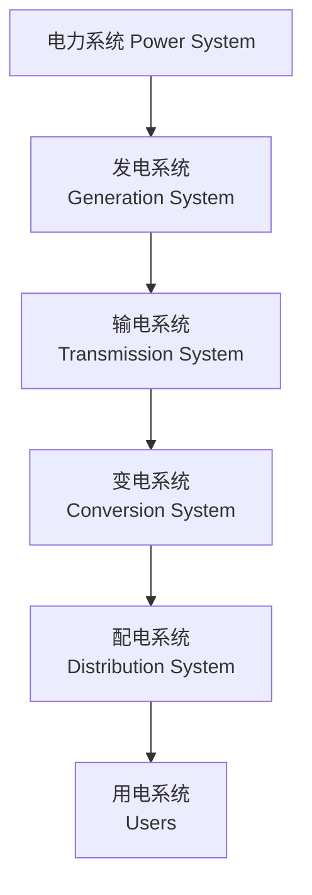

电力系统是由**发电、输电、变电、配电、用电**五个核心环节组成的统一整体，其核心目标是**安全、经济、优质**地将电能从发电厂输送到电力用户。

## 一、 电力系统的基本组成

1. **发电环节**是电力系统的源头，作用是将其他形式的能量转化为电能。
    
    - 主要发电厂类型：
        - 火力发电厂：以煤炭、天然气、石油为燃料，通过燃烧加热蒸汽驱动汽轮机发电，目前仍是我国主力电源之一。
        - 水力发电厂：利用水流的势能推动水轮机发电，属于清洁能源，具有调峰、储能等优势。
        - 核能发电厂：利用核裂变释放的能量加热蒸汽发电，能量密度高、污染小。
        - 新能源发电：包括太阳能光伏发电、风力发电、生物质能发电等，是未来能源转型的核心方向。
2. **输电环节**作用是将发电厂发出的电能远距离输送到负荷中心（如城市、工业区），解决电能 “送得远” 的问题。
    
    - 核心特点：采用**高压 / 超高压 / 特高压**输电，原因是在输送功率相同的情况下，电压越高，电流越小，线路的功率损耗和电压损耗越小，经济性越好。
    - 主要设备：输电线路（架空线路、电缆线路）、输电铁塔、绝缘子等。
3. **变电环节**核心是**变压器**，作用是改变电压等级，满足输电、配电的不同需求。
    
    - 升压变电：发电厂输出的电能先通过升压变压器升高电压，便于远距离输电。
    - 降压变电：电能输送到负荷中心后，通过变电站的降压变压器逐级降低电压（如从 500kV 降至 220kV，再降至 110kV、10kV），最终送入配电系统。
4. **配电环节**是将降压后的电能分配到千家万户和各类用电设备的环节，解决电能 “送得到” 的问题。
    
    - 电压等级：通常为 10kV、0.4kV（380V/220V），其中 0.4kV 为低压配电，直接面向用户。
    - 主要设备：配电变压器、配电柜、配电箱、低压线路等。
5. **用电环节**是电力系统的终端，电能在此转化为机械能、热能、光能等其他形式的能量。
    
    - 用电负荷分类：
        - 工业负荷：如工厂的电动机、电炉等，功率大、对供电可靠性要求高。
        - 农业负荷：如灌溉水泵、农机设备等。
        - 居民生活负荷：如家用电器、照明等，负荷波动较大（高峰在早晚时段）。
        - 商业负荷：如商场、写字楼的空调、照明、电梯等。

## 二、 电力系统的核心参数

1. **电压等级**是电力系统的重要标识，不同环节采用不同电压等级，我国常用电压等级如下：
    
    - 特高压：1000kV（交流）、±800kV（直流）
    - 超高压：330kV、500kV
    - 高压：110kV、220kV
    - 中压：10kV、6kV
    - 低压：0.4kV（380V/220V）
2. **频率**指交流电的交变频率，我国电力系统的额定频率为**50Hz**，频率稳定是电能质量的重要指标，偏差一般需控制在 ±0.2Hz 以内。
    
3. **功率与功率因数**
    
    - 有功功率（P）：实际做功的功率，单位为千瓦（kW），用于满足用户的用电需求（如电机转动、照明发光）。
    - 无功功率（Q）：用于建立磁场、维持电压稳定的功率，单位为千乏（kvar），不直接做功，但会增加线路损耗。
    - 视在功率（S）：有功功率与无功功率的矢量和，单位为千伏安（kVA），\(S=\sqrt{P^2+Q^2}\)。
    - 功率因数（cosφ）：有功功率与视在功率的比值，\(\cos\varphi=\frac{P}{S}\)，理想值为 1，提高功率因数可降低线路损耗、提高设备利用率。

## 三、 电力系统的运行要求

1. **安全运行**
    
    是首要目标，需防止发生短路、过载、设备故障等事故，避免大面积停电。核心措施包括继电保护、绝缘防护、设备巡检等。
2. **经济运行**
    
    要求在满足供电需求的前提下，降低发电成本和输电损耗，例如优化发电厂的出力分配、提高电网的功率因数。
3. **优质供电**
    
    需保证电能质量，主要指标包括：
    - 电压偏差：用户端电压波动需在额定值的 ±5% 以内。
    - 频率偏差：稳定在 50Hz±0.2Hz。
    - 谐波含量：减少非线性负荷（如变频器、节能灯）产生的谐波，避免影响设备正常运行。

## 四、 电力系统的调度与控制

电力系统是一个**实时平衡**的系统，发电功率必须时刻等于用电功率（含线路损耗），否则会导致频率和电压波动。

- **电力调度中心**：是电力系统的 “大脑”，负责统筹各类发电厂的出力、安排电网运行方式、处理故障，保障电网安全稳定运行。
- **自动控制装置**：如自动发电控制（AGC）、自动电压控制（AVC），可实时调节发电机的出力和变压器的分接头，维持系统频率和电压稳定。

## 五、 电力系统的发展趋势

1. **新能源高比例并网**：太阳能、风能等新能源发电占比不断提升，推动电网向**智能电网**转型。
2. **特高压电网建设**：通过特高压输电实现 “西电东送、北电南供”，优化能源资源配置。
3. **储能技术应用**：储能设备（如锂电池储能、抽水蓄能）可平抑新能源发电的波动性，提升电网灵活性。
4. **电力电子化**：大量电力电子设备（如逆变器、柔性直流输电装置）的应用，改变了传统电网的特性，对电网控制提出更高要求。