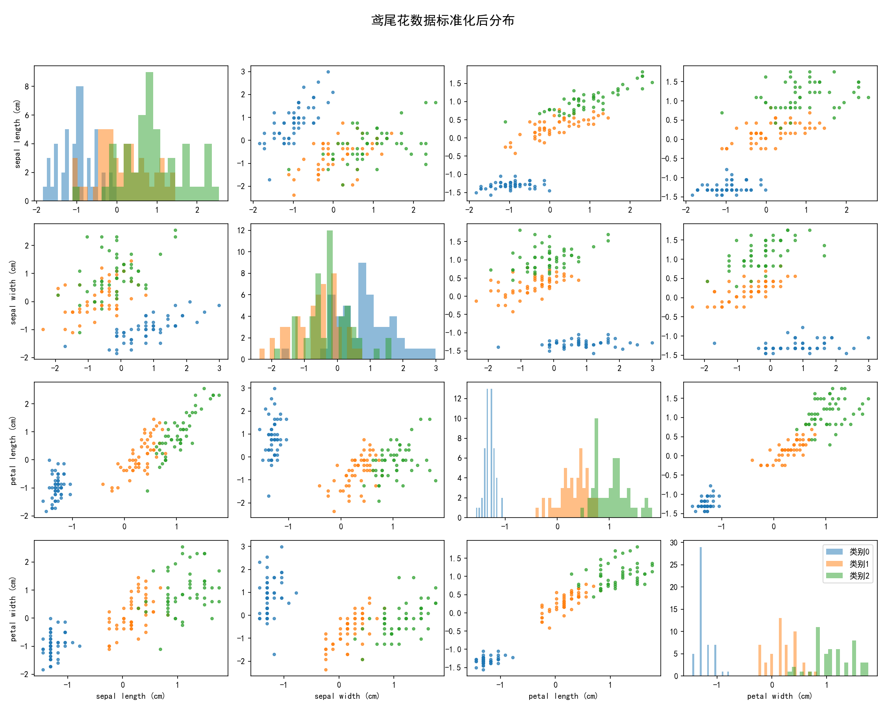
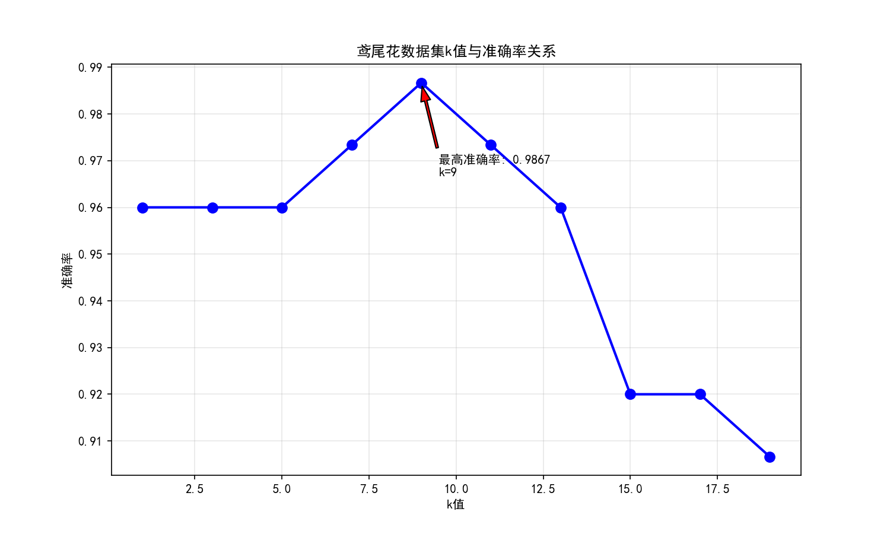
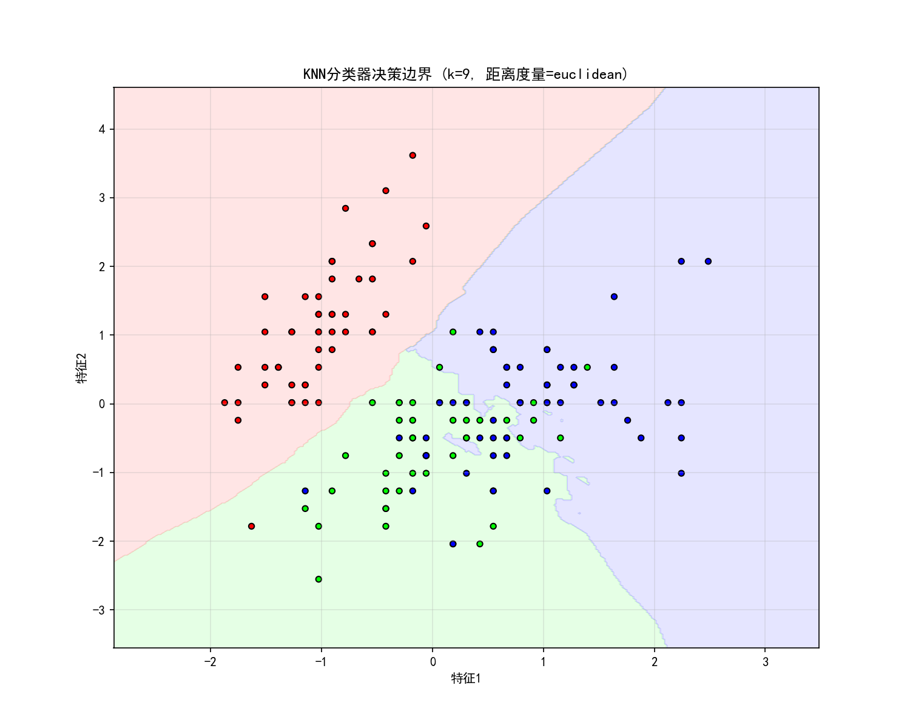
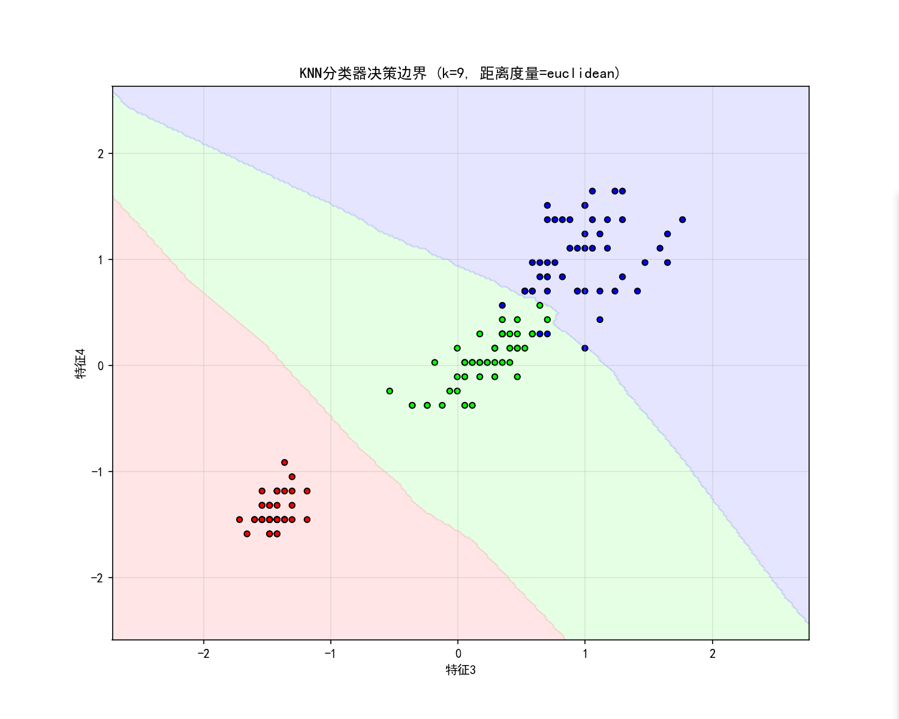

# K近邻算法（KNN）
1. 定义：是一种监督学习算法，核心是“近朱者赤，近墨者黑”。
2. 特性：懒惰学习算法，没有训练过程，不会像其他算法拟合出一个模型参数，而是直接存储所有训练样本，仅在预测时才进行计算。
3. 筛选k个最近邻
	对所有训练样本和测试样本x计算距离、排序、选取距离最小的前k个样本
4. 投票/ 平均
	- 分类任务：多数投票法
	- 回归任务：平均值法 
5. 优缺点
	- 优点：原理简单，容易实现
	- 缺点：预测时计算量大

